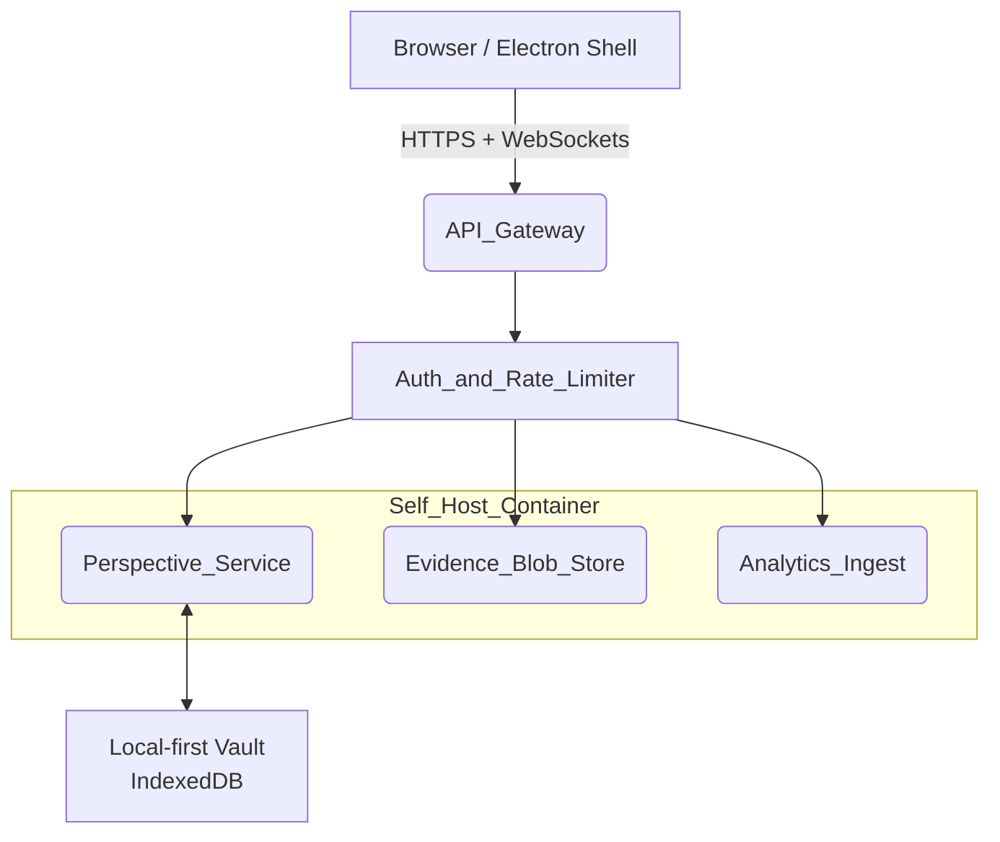

<!-- phase:1 --><!-- draft -->
# Logical Architecture

| Layer         | Tech choice                                                                                | Notes                                                                                   |
| ------------- | ------------------------------------------------------------------------------------------ | --------------------------------------------------------------------------------------- |
| Front‑end     | React 18 + Vite + PNPM                                                                     | Light DOM; Canvas via SVG for a11y; WASM for Monte‑Carlo.                               |
| Gateway       | Fastify + tRPC                                                                             | Single HTTP/2 entry point; JSON RPC stream.                                             |
| Storage       | Perspective snapshots in **Postgres‑JSONB**   Evidence blobs in **S3‑compatible minio** | Local‑first vault syncs on reconnect using CRDT merge‑wins rules (see _Sync Protocol_). |
| AuthN         | JWT (HS256)                                                                                | Optional OIDC proxy for enterprise installs.                                            |
| Observability | OpenTelemetry JSON → Loki/Grafana                                                          | Metric names in _Event Taxonomy_.                                                       |
