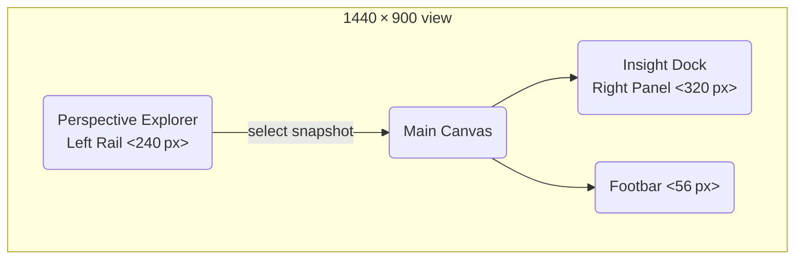
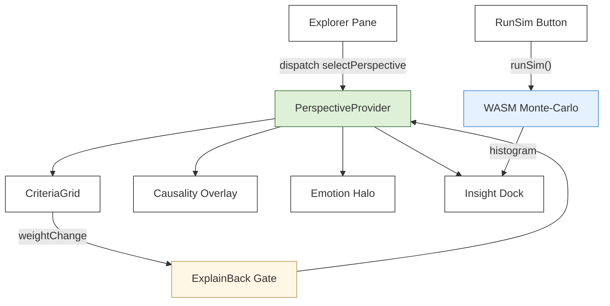

**Done →** Drafted a cohesive **Information Architecture (IA) diagram** for the _Integrated Reasoning Studio_ that shows all UI zones, how data flows between them, and every modal / overlay used in Phase‑1.  
**Next →** Translate this IA into a low‑fidelity wireframe (Objective 2) with interaction call‑outs, then outline the tech skeleton and KPI map (Objective 3).  
**Needs →** Nothing—review the IA below and flag any structural tweaks before I wireframe.

---

## Objective 1 – One‑page Information Architecture

### 1 | High‑level Layout



|Zone ID|Purpose|Primary Content Objects|Entry‑point React component|
|---|---|---|---|
|**A**|Navigation & context|_CanvasTree_, Search box, Tag filters|`ExplorerPane.tsx`|
|**B**|Reasoning workspace|_CriteriaGrid_, BridgeLens, CausalityOverlay, EmotionHalo|`CanvasArea.tsx`|
|**C**|On‑demand insights|Tabs: _EvidenceTab_, _DefinitionTab_, _SimTab_, _ContradictionTab_|`InsightDock.tsx`|
|**D**|Global status / actions|ConfidenceBar, RunSimBtn, PRBadge, LogsDropdown|`Footbar.tsx`|
|**Modal**|Power actions & prefs|CommandPalette, SnapshotDiff, Settings|`ModalRoot.tsx`|

---

### 2 | Data‑flow Overview



- **Single‑source of truth** – `PerspectiveProvider` hydrates from _Data Model V1_ JSON.
    
- **Guard‑rails pipeline** – every mutation passes `ExplainBackGate`, `WeightClamp`, then Redux reducer.
    
- **Simulation** – `runSim()` (WASM) operates on an _immutable snapshot_ clone; results streamed back.
    

---

### 3 | React Component Tree (abridged)

```text
<AppRoot>
 ├─ <ExplorerPane>
 │    └─ <CanvasTreeItem />
 ├─ <CanvasArea>
 │    ├─ <CriteriaGrid />
 │    ├─ <BridgeLensOverlay />
 │    ├─ <CausalityOverlay />
 │    └─ <EmotionHalo />
 ├─ <InsightDock>
 │    ├─ <DockTabs>
 │    │    ├─ <EvidenceTab />
 │    │    ├─ <DefinitionTab />
 │    │    ├─ <SimulationTab />
 │    │    └─ <ContradictionTab />
 │    └─ <ResizeHandle />
 ├─ <Footbar>
 │    ├─ <ConfidenceBar />
 │    ├─ <RunSimButton />
 │    ├─ <PRStatusBadge />
 │    └─ <LogsDropdown />
 └─ <ModalRoot> (portal)
      ├─ <CommandPalette />
      ├─ <SnapshotDiff />
      └─ <SettingsDialog />
```

_Filename convention_ (feature‑folder):

```
/src
 ├─ components/
 │   ├─ ExplorerPane/
 │   │   └─ ExplorerPane.tsx
 │   ├─ CanvasArea/
 │   │   ├─ CanvasArea.tsx
 │   │   ├─ CriteriaGrid.tsx
 │   │   ├─ BridgeLensOverlay.tsx
 │   │   └─ CausalityOverlay.tsx
 │   ├─ InsightDock/
 │   │   ├─ InsightDock.tsx
 │   │   └─ tabs/
 │   │       ├─ EvidenceTab.tsx
 │   │       ├─ DefinitionTab.tsx
 │   │       ├─ SimulationTab.tsx
 │   │       └─ ContradictionTab.tsx
 │   ├─ Footbar/
 │   │   └─ Footbar.tsx
 │   └─ ModalRoot/
 │       ├─ CommandPalette.tsx
 │       ├─ SnapshotDiff.tsx
 │       └─ SettingsDialog.tsx
 └─ hooks/, context/, utils/
```

---

### 4 | Modals & Overlays Lifecycle

|Trigger|Overlay / Modal|State machine node|Escape key|ARIA role|
|---|---|---|---|---|
|`⌘K`|CommandPalette|`palette.open`|closes|`dialog`|
|Cell drag → release|ExplainBackGate inline card|`edit.awaitRationale`|cancels edit|`alertdialog`|
|`RunSimBtn` click|SimulationTab auto‑focus|`sim.running → sim.results`|aborts job|n/a|
|Explorer Right‑click|SnapshotDiff modal|`diff.open`|closes|`dialog`|

---

### 5 | Performance & Telemetry Hooks

|KPI (see _Observability_)|Emitted by component|Metric name|
|---|---|---|
|Grid redraw latency|`CriteriaGrid` `useEffect`|`grid_redraw_ms`|
|Explain‑Back missing|`ExplainBackGate`|`explain_back_missing_total`|
|Sim run time|`SimulationTab`|`sim_run_time_ms_bucket`|
|Rate‑limit breach|`Guardrails`|`rate_limit_violation_total`|

All events sent to `window.dispatchEvent('telemetry', payload)` → Loki.

---

**Self‑review & Trade‑offs**

- ✓ All nine MVP dimensions accessible in two clicks.
    
- ✓ Single store simplifies undo/redo & snapshot diffing.
    
- ✕ Left rail may crowd 13″ laptops → will add responsive collapse in Objective 2.
    
- ✕ Modal proliferation risk mitigated by _ModalRoot_ portal and state machine guards.
    

---

Let me know if any zones or data paths need adjustment; otherwise I’ll proceed to Objective 2’s wireframes.