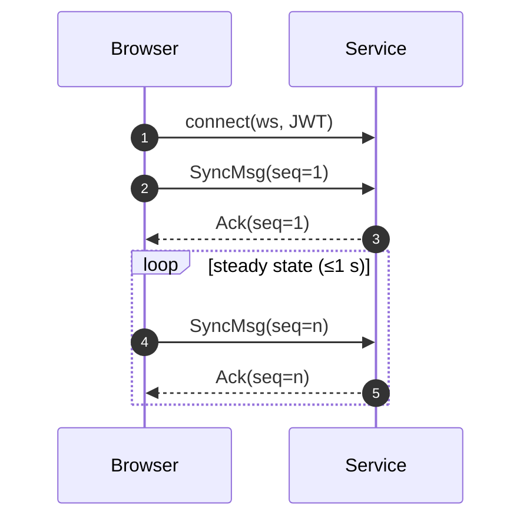

<!-- phase:1 --><!-- draft -->
## Sync & Conflict‑Resolution Protocol

### Goals

1. **Offline‑first editing** — must work on a plane.
    
2. **Deterministic merges** — no hand‑written conflict dialogs for numeric weights.
    
3. **Human‑readable history** — `git log`‑style diff for audits.
    

### Approach

|Concern|Decision|
|---|---|
|CRDT vs OT|**JSON CRDT (Automerge 2.0)** – numeric registers + arrays|
|Snapshot version‑ids|`sha256(model)[:12]`. **Nested snapshots** use the same id space; `drilldown.snapshot_id` acts as the pointer|
|Merge strategy|“Last‑writer‑wins **per field**” except `weight`, which applies **mean** if edits < 5 min apart and authors are distinct|
|Fork lineage|Parent snapshot id stored in `meta.parent_snapshot_id`|
|PR diff display|Render automerge patch as column/row deltas; causal edges diff separately|

---

### Sync Flow

1. **Edit offline** → operations logged in IndexedDB (`oplog` table)
    
2. Reconnect → send oplog to `/sync` endpoint
    
3. Server applies CRDT merge, returns **vector clock**
    
4. Client rewinds local state, reapplies remote ops, fast‑forwards — minimal UI flicker
    

_Edge cases (clock skew, deliberate rebasing) captured in Appendix A._

---

## ✅ Sync Protocol v0.9 (MVP)

> Goal: Keep **local‑first vaults** and **remote Perspective Service** in eventual consistency  
> while preserving _cryptographic provenance_ and _CRDT merge‑safety_.

|Layer|Spec / Tooling|Purpose|
|---|---|---|
|**Transport**|WebSockets (binary), fallback = HTTPS `/sync`|Duplex channel, delta‑push < 1 s|
|**Envelope**|protobuf `SyncMsg`|Minimal framing + gzip|
|**CRDT**|**Automerge 2** (binary format)|JSON‑like, offline‑merge friendly|
|**Auth**|JWT (per session)|Same token as Perspective API|
|**Integrity**|per‑chunk `sha256` + chain‑hash header|Detect tamper / replay|
|**Flow control**|`sync_ack`, `sync_request_missing`|RTT‑aware, back‑pressure friendly|

---

### 1. Message Types

message SyncMsg {
  string vault_id          = 1;   // 128‑bit uuid
  uint32 seq               = 2;   // monotonically ++ per sender
  bytes  automerge_patch   = 3;   // compressed patch blob
  string prev_chunk_hash   = 4;   // sha256 of previous SyncMsg
  string author_sig        = 5;   // Ed25519(sig(seq || hash))
  oneof  kind {
    Ack  ack               = 6;
    Req  request_missing   = 7;
  }
}

_Failed hash or sig → peer replies with `request_missing` and pauses merge._

mermaid

_Latency budget: patch ≤ 25 KB, round‑trip ≤ 250 ms on 150 ms RTT_

---

### 2. Offline / Conflict Flow

1. **Offline edit** → Automerge logs local patch
    
2. **Reconnect** → browser sends `have_heads` list
    
3. **Service compares** → returns missing heads
    
4. Automerge 3‑way merge resolves; conflicts surface as:
    
    - dual‑value cell → UI shows ⚠ and asks user to pick or average
        
5. New snapshot stored, chain‑hash continues unbroken
    

---

### 3. Security Guarantees (Phase 1)

|Risk|Mitigation|
|---|---|
|Replay‑attack|chain‑hash + monotonically increasing `seq`|
|Rogue patch|Ed25519 sig must match vault’s root key|
|Downgrade|Client rejects protocol < 0.9|
|Snooping|TLS 1.3 on all channels|

> **Future (Phase 3)** — Add Merkle‑clock snapshots so peers can prove  
> they received but did not tamper with a patch (ref: Resilient Governance)

---

### 4. Multi‑Head Handshake

The client advertises **all heads currently open in the `openStack`**.  
The server responds with missing patches per head.  
This costs one extra RTT but avoids oversending.

---

## ✅ Snapshot JSON Schema

### Scope

A **single JSON document** describes one **Perspective** snapshot.  
Everything on-screen—weights, evidence, edges, authorship—serialises to this tree.

---

### Top-level keys

|key|type|notes|
|---|---|---|
|`meta`|object|`id`, `created_at` (ISO-8601), `parent_snapshot_id`, `fork_of_id`, `license_code`|
|`agent`|object|`id`, `display_name`, `identity_tier` ('anon','pseudo','verified')|
|`grid`|array|rows of **CriteriaRow** objects|
|`edges`|array|causal **Edge** objects (Dimension 5)|
|`evidence`|array|**EvidenceCard** objects referenced by rows and edges|
|`confidence`|number|0–1 global certainty slider (Dimension 3)|
|`emotion`|object|`valence` −1…1, `arousal` 0–1 (Dimension 4)|
|`badges`|object|`reputation` 0–5 ⭐, `license` ('MIT','CC-BY-SA','PROPRIETARY') (Dim. 8)|
|`simulation`|object|null or metadata from latest Monte-Carlo run (seed, variance, bins) (Dim. 9)|

---

### WeightCell

|key|type|notes|
|---|---|---|
|`criterion_id`|string|e.g. `"long_term_cost"`|
|`weight`|number|−100…100 (clamped by guard‑rail)|
|`loc_conf`|number|0–1 local confidence|
|`evidence_id`|string?|FK into `evidence` array|
|`drilldown`|object?|Optional nested sub‑snapshot|
|`updated_by`|string|agent id|
|`updated_at`|string|ISO-8601|

---

### drilldown object

|field|type|notes|
|---|---|---|
|`snapshot_id`|string|FK → another snapshot in the same vault. Immutable once written.|
|`reducer`|enum|`'sum'` \| `'conf_weighted'` \| `'pareto'` — deterministic roll-up|
|`last_rollup`|number|Cached numeric value shown in the parent grid. Recomputed on save.|

> **Guard‑rail:** Client clamps recursion depth at 3 (configurable).  
> Deeper drill‑downs require a feature flag.

---

### CriteriaRow

|key|type|notes|
|---|---|---|
|`option_id`|string|choice / stance label|
|`cells`|array|array of **WeightCell**|

---

### Edge (Dimension 5)

|key|type|notes|
|---|---|---|
|`from`|object|`{option_id, criterion_id}`|
|`to`|object|`{option_id, criterion_id}`|
|`strength`|number|−1…1|
|`evidence_id`|string|FK|
|`confidence`|number|0–1|

---

### EvidenceCard

|key|type|notes|
|---|---|---|
|`id`|string|sha256 hash|
|`title`|string|short source name|
|`source_url`|string|canonical link or DOI|
|`cred_score`|number|0–1 from `credibility_rubric.json`|
|`mime`|string|'text/html', 'application/pdf', etc.|
|`added_by`|string|agent id|
|`added_at`|string|ISO-8601|

---

### Validation

`snapshots/perspective_v1.json` (AJV schema) is shipped in-repo.  
CI rejects snapshots that fail validation or violate guard-rails.

---

### Example (Minimal)

json

CopyEdit

`{   "meta": {     "id": "snap_01",     "created_at": "2025-07-13T14:05:27Z",     "license_code": "MIT"   },   "agent": {     "id": "u123",     "display_name": "Evan",     "identity_tier": "pseudo"   },   "grid": [     {       "option_id": "desalination",       "cells": [         {           "criterion_id": "cost",           "weight": -32,           "loc_conf": 0.8,           "evidence_id": "e1",           "updated_by": "u123",           "updated_at": "2025-07-13T14:05:00Z"         }       ]     }   ],   "edges": [],   "evidence": [     {       "id": "e1",       "title": "World Bank LCOE Study",       "source_url": "https://doi.org/...",       "cred_score": 0.92,       "mime": "application/pdf",       "added_by": "u123",       "added_at": "2025-07-13T14:04:55Z"     }   ],   "confidence": 0.62,   "emotion": {     "valence": 0.1,     "arousal": 0.3   },   "badges": {     "reputation": 4.2,     "license": "MIT"   },   "simulation": null }`